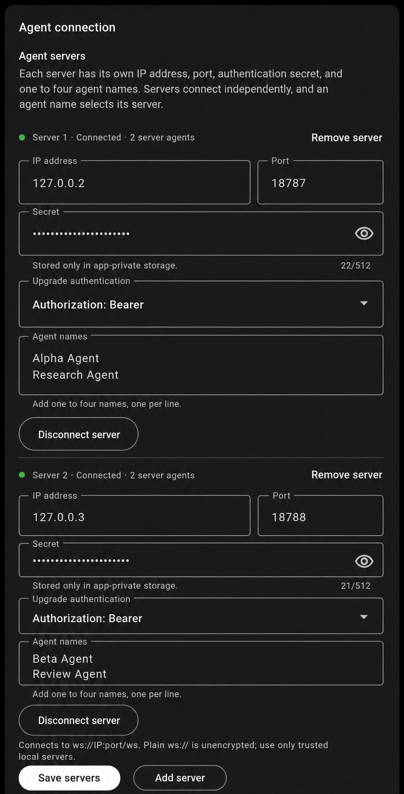

<h1>
  
  Work Bench
</h1>

Work Bench is a local-first wearable work agent built around the Even
Realities G2 glasses and R1 ring.

## Project goal

The goal is to turn continuous G2 audio and intentional R1 gestures into a
hands-free interface for managing technical work. An on-device, local-first
mobile agent interprets requests, maintains task context, asks for confirmation
when needed, and delegates well-scoped work to Claude Code or Codex terminal
sessions running on the user's computer. Progress, questions, and results can
then return to the glasses, with the ring providing discreet approval and
navigation.

```text
G2 audio + R1 gestures
          ↓
Work Bench mobile agent
          ↓
Authenticated local computer bridge
          ↓
Claude Code / Codex terminal workers
          ↓
Status, questions, and approvals on G2 + R1
```

This repository combines the hardware foundation already needed for that
vision: low-level dual-lens G2 BLE, R1 connectivity and gesture research,
continuous LC3 audio, durable local capture, VAD, on-device transcription,
on-glasses feedback, background operation, reconnect and Hub-page recovery,
raw diagnostics, an authenticated local WebSocket bridge, and the documented
firmware limitations. Broader intent processing and terminal-specific adapters
remain future product layers.

Here, **local-first** means the wearable connections, session control, desktop
bridge, and owned context stay on the user's devices. Claude Code or Codex may
still use whichever hosted model services the user configures.

## Hub soft-kiosk goal

This build keeps a custom EvenHub page active with continuous microphone
streaming. The page starts without text, shows a voice-responsive grayscale
pulse, and displays R1 gestures to its right.

It is a best-effort **soft kiosk**, not a firmware-level locked mode. The app
can restore its page and audio stream after recoverable interruptions, but the
G2 operating system still owns the global Menu and other system surfaces.

## Limitations

| Requirement | Current result |
| --- | --- |
| Stay in Daily/Hub mode | Yes; `MODE_DAILY` is reasserted after connection |
| Start and maintain microphone streaming | Yes; starts automatically and restarts after recovery |
| Keep tap and double-tap from stopping audio | Yes; tap commits a queued display item or opens history, and double-tap requests the last sent agent's update |
| Show tap and swipe; use double-tap for an agent update | Yes |
| Show long press | Inferred from R1 activity and Hub lifecycle evidence |
| Receive real long-press down/up in Hub | No; available only in Terminal mode |
| Disable the native global Menu | No; firmware reserves hold for the Menu |
| Guarantee the Hub page never exits | No; native system UI has priority |
| Control R1 directly from the phone | Not exposed; tested management GATT did not emit gestures |
| Decode and transcribe G2 audio on iOS | Not yet; the native LC3 bridge is currently Android-only |
| Run indefinitely in the background | Android is best-effort; iOS cannot guarantee this |

The fundamental limitation is that Daily/Hub mode publishes tap, double-tap,
and swipe, while the G2 firmware consumes hold as the global Menu command.
Terminal mode exposes real hold start/stop events, but Terminal and an EvenHub
page cannot own the foreground simultaneously.

See the [hardware-verified Hub/Terminal long-press analysis](docs/G2_R1_HUB_LONG_PRESS.md)
for protocol traces, approaches tested, and what Even Realities would need to
expose for a true locked Hub mode.

## From hardware POC to work agent

| Layer | Status |
| --- | --- |
| G2/R1 discovery, connection, protocol, and diagnostics | Implemented |
| Continuous LC3 stream, audio pulse, gestures, and Hub recovery | Implemented |
| Android foreground operation and iOS background-central support | Implemented within platform limits |
| Durable LC3 capture, VAD, and selectable local Whisper/Parakeet STT | Implemented on Android |
| Optional independent speaker diarization and conversation history | Implemented on Android; disabled by default |
| Gemma 4 post-STT correction with separate original/corrected files | Implemented on Android; GPU-qualified on the representative RedMagic phone |
| Local `Hey Memo` iterative voice notes with G2 double-tap finish | Implemented on Android |
| On-device intent, task context, and approval policy | Planned |
| Authenticated WebSocket bridge to the user's computer | Implemented; local `ws://` transport |
| Claude Code and Codex terminal adapters | Planned |
| Glasses status, questions, approvals, cancellation, and results | Planned |

## Current hardware experience

- Connects both G2 lenses and an R1 ring.
- Starts raw 16 kHz mono LC3 streaming automatically.
- Journals compressed audio before decoding, saves VAD speech with a
  two-second pre-roll, and transcribes locally with a Tools-selectable local
  model. In the default flow, a turn closes only after VAD remains inactive for
  1.5 seconds (about two seconds of acoustic silence including Silero's 500 ms
  qualification). Selected-agent Listen Mode uses its separate one-second
  VAD-inactive endpoint for each STT audio chunk while its manual session stays
  open. Parakeet 0.6B is the current default; Parakeet 110M
  and Tiny Whisper remain available.
- Lets Android users choose a shared device folder for Files-visible speech
  WAVs plus separate `.raw.txt`, `.corrected.txt`, and optional
  `.conversation.txt` transcripts. The existing **Messages** tab continues to
  show agent messages, original/corrected transcripts, and WAV playback.
- Offers disabled-by-default speaker diarization under **Tools → Conversation
  analysis**. The first clear sentence enrolls `You`; new voices receive saved
  labels. A supervised isolate reuses the finalized VAD WAV and runs its own
  CPU speaker models and Parakeet 110M recognizer. Home's **Conversation** tab
  is separate from Messages; it reads only speaker turns from an app-private
  SQLite index and displays aligned turns with grayscale speaker markers. This
  optional path has its own queue and may run a second Parakeet instance in
  parallel. Its startup, diarization, transcription, shutdown, and persistence
  cannot delay or route through the ordinary STT, Gemma, glasses, or agent
  WebSocket path.
- Runs Gemma 4 E4B correction through pinned LiteRT-LM in a dedicated Android
  process after Parakeet commits the raw transcript. A complete,
  case-insensitive leading `hey` gates the correction queue, so ambient speech
  and mid-sentence mentions are durably saved without invoking the LLM.
  Continuous speech uses a
  soft 15-second boundary: the next short inter-word audio gap or VAD pause
  closes the chunk before resumed speech, while uninterrupted speech
  hard-closes at 17 seconds with one second
  of audio overlap. Exact overlap words are removed when text is appended to
  one conversation file. The correction queue is
  durable and never blocks capture, VAD, or STT.
- Recognizes a leading `Hey Memo` locally, including conservative Gemma
  correction of plausible acoustic variants, and consumes the following live
  turns without sending them to the agent WebSocket. Gemma revises the
  app-private memo after each corrected utterance. The Conversation tab shows
  the live and saved note, five seconds of total silence finalizes it, and the
  G2 page keeps `Double Tap to finish` above the bounded live draft and lets
  swipe down/up page forward/back through longer notes.
- Saves up to eight authenticated agent servers under **Tools → Agent
  connection**. Every server entry has a different IPv4 address plus its own
  port, authentication secret, upgrade-header mode, status, FIFO, retry
  lifecycle, and up to four agent names. Servers can be added and removed in
  Settings. Agent names uniquely select their server; one failed socket never
  blocks another. Gemma uses
  all names as correction vocabulary, and only the corrected live transcript
  is matched and sent after that endpoint's `connection.ready`. Each G2 status
  follows one FIFO lifecycle:
  `Queued:` while awaiting input, `Sending:` after a leading-`Hey` queued item
  is tapped, then `Saved:` or acknowledged `Sent:` for two seconds before
  clearing. Transcript statuses and inbound server messages replace the
  compact two-row visualizer slot with the full-height G2 text page, allowing
  long text to use the complete viewport and firmware scrolling. Inbound
  messages appear as serialized `Received:` items, are saved to the selected
  Files folder, and clear from the glasses after two seconds.

### Multiple agent servers



Each card is one independently managed server. For example:

| Server | IPv4 address | Port | Authentication secret | Agent names |
| --- | --- | ---: | --- | --- |
| 1 | `127.0.0.2` | `18787` | its own masked secret | `Alpha Agent`, `Research Agent` |
| 2 | `127.0.0.3` | `18788` | a different masked secret | `Beta Agent`, `Review Agent` |

Use **Add server** to create another card, **Remove server** to delete one, and
**Save servers** to apply the list. Removing or changing one server closes only
that server's WebSocket; unchanged servers remain connected. Each server IP
produces exactly one status dot on the main screen. The names beneath that
server become routing buttons in the Messages tab.
- Gives a visible `Queued:` transcript priority over the single-tap history
  selector. Tap immediately resolves a transcript without leading `Hey` to
  `Saved:`; a leading-`Hey` tap immediately changes the item to `Sending:` and
  moves its durable Gemma job ahead of other ready correction work, then the
  normal configured-agent, acknowledgement, send, and archive rules apply.
  With no queued transcript, tap opens history.
- Uses an ordinary G2/R1 double tap to request a read-only progress summary from
  the last agent that successfully received a live command. The returned
  `summary.result` follows the same durable `Received:` path. During a voice
  memo, double tap retains its higher-priority finish action.
- Implements the fallback single-tap agent history selector with `Dismiss`
  selected first, a window over every configured agent, and the local Memo
  option last.
  Each agent option starts with `[Agent] content` and may use one aligned
  continuation row; elapsed time is not displayed. Agents with received
  history are ordered by newest inbound message, while never-received agents
  follow in configuration order. Carriage returns, newlines, and repeated
  whitespace are collapsed to spaces before width measurement, and overflow
  after the second row is ellipsized. Every rendered row reserves the
  same fixed 25-pixel pointer gutter, including two spaces after `>`, so content
  remains at the same horizontal position while selection moves. Complete
  one- or two-row entries are adaptively windowed inside an eight-row selector,
  leaving the ninth physical row unused so firmware scrolling cannot claim a
  swipe.
  Each agent preview uses its newest
  durable message by timestamp, whether that message was sent or received.
  Agent detail pages rebuild the same durable newest-message-first sent and
  received list as the phone agent tab, shown as `[HH:mm] Message`. Saving the
  socket configuration does not clear this history, and startup reindexes its
  durable message files if the performance index is missing. Agent details
  open with `   [Flux] - Swipe to Navigate` and
  ` >  • Listen Mode - Tap to start`; opening the agent
  does not target audio. A second tap changes the Listen arrow from `>` to `<`
  and enables targeting. Swipe up stops Listen Mode and moves the active `<`
  control to the Flux title; tapping there returns to the selector. Swipe down
  returns focus to Listen Mode. While it is active, a down swipe pages the
  transcript directly.
  Exiting Listen Mode clears its temporary
  listening overlay, restores the message page that was visible before speech,
  and immediately re-enables history paging. Memo details
  continue paging immediately. The prior page's final
  content row is repeated first on the next page. History uses a borderless
  576×288 viewport with a stable four-pixel inset on every selector and detail
  page; inactive agent details retain seven body rows beneath two fixed
  lines, active sessions also retain seven beneath two fixed lines, Memo
  details retain eight, and all show only a proportional
  right-edge scroll thumb. Detail pages are pre-paginated, keep a fixed
  scrollbar image container, and use serialized in-place updates while
  scrolling instead of rebuilding the page on every swipe. A render-safety
  guard validates the complete UTF-8 frame, suppresses an identical frame,
  and defers any page replacement requested during a swipe until the settled
  recovery path can recreate it. The tap that
  activates Listen Mode snapshots that configured agent and starts a manual
  transcript session without requiring a spoken `Hey` or agent name. Otherwise
  audio follows the ordinary transcription and wake-word route. The title
  remains `[Flux] - Swipe to Navigate`, while the selected control becomes
  ` <  • Send transcript - Tap`. Preview Correction is always enabled
  and has no selectable row or toggle. Each full second
  with VAD inactive closes only an audio chunk and queues it in the persistent STT FIFO;
  it never exits Listen Mode or sends. As STT chunks finish, only their
  accumulated transcript text appears in the body. Later speech continues
  appending regardless of earlier VAD
  endpoints. Every completed STT append automatically refreshes one serialized
  correction preview. The second row continues to show the available tap
  action. Sending waits for and reuses the current preview, so it never invokes
  Gemma a second time. During that work the fixed title remains unchanged and
  the action row becomes ` <  • Sending - Wait`; repeated taps are consumed
  without changing the page while delivery is in flight. New speech after
  Listen Mode exit is no longer targeted to the previously
  selected agent. Selected-agent correction enters ahead of pending normal
  corrections while any already-running Gemma inference finishes safely.
  Every indexed matching-agent socket response refreshes page 1 immediately;
  other-agent responses remain durable without interrupting the open detail.
  Dismiss and Memo never enable this endpoint override. See
  [`docs/G2_AGENT_HISTORY_SELECTOR.md`](docs/G2_AGENT_HISTORY_SELECTOR.md).
- Draws a dim-to-bright pulsing dot in the upper-left using LC3 global gain and
  an adaptive silence floor.
- Displays `Tap`, `Swipe up`, `Swipe down`, and `Long press (inferred)`;
  double tap displays the requested agent update instead of a gesture label.
- Shows one live audio summary plus concise connection, gesture, and lifecycle
  events without flooding the Home screen with raw packets.
- Keeps manual display commands and raw G2 diagnostics behind the upper-right
  **Tools** icon.
- Uses an Android foreground service and declares iOS
  `bluetooth-central` background support.
- Prevents screen sleep while the app is visible and preserves active BLE,
  reconnect, and LC3 work during temporary app switching.

## Connect a local agent WebSocket

Open **Tools → Agent connection** and add each numeric IP address, numeric port,
secret, upgrade authentication header, and one to four unique agent names.
Every address connects independently. For example, Work Bench connects to:

```text
ws://127.0.0.1:8787/ws
```

The secret is stored only in app-private `workbench/voice_websocket.json` and
is sent only during the HTTP upgrade as either:

```text
Authorization: Bearer <local-secret>
```

or:

```text
X-Voice-Api-Token: <local-secret>
```

The client sends no hello message. It waits for `connection.ready`, routes a
complete configured agent-name match with `message.send`, correlates the
server's `message.accepted` using `request_id`, and resumes from the last
observed event ID after an unexpected reconnect.

After a successful agent delivery, an ordinary G2/R1 double tap sends a
`summary.request` for that same agent. Changing connection configuration clears
the in-memory last-agent selection.

Agent progress and completion replies arrive as `message.progress` and
`message.completed`. Work Bench reads their concise text from
`payload.summary` or `payload.completion_message`, queues it on the G2 with a
  `Received:` prefix, and saves an atomic app-private
  `workbench-websocket-<timestamp>-<sequence>.received.message.txt` record.
Acknowledged outgoing commands are saved with the matching
`.sent.message.txt` suffix. When a shared File storage folder is selected,
both directions are copied there for access by Files and other apps and remain
available with transcripts in the **Messages** tab.

[`voice_websocket.example.json`](voice_websocket.example.json) documents the
validated app-private schema. Agent names are matched case-insensitively as
complete phrases. When a transcript starts with the selected name, Work Bench
removes that spoken invocation from the outgoing message; a name elsewhere in
the corrected transcript selects the agent while preserving the full text.
The raw and corrected transcript files remain separate, and transcription or
correction jobs restored after a process restart are never allowed to send an
old command.

`ws://` is unencrypted, so use it only over a trusted local connection. On an
Android phone, `127.0.0.1` means the phone, not the development computer. For a
computer-hosted development server on port 8787, an explicit USB bridge keeps
the configured endpoint on loopback:

```sh
adb -s <android-serial> reverse tcp:8787 tcp:8787
```

The secret, endpoint, transcripts, inbound message content, request IDs, and
server session IDs are excluded from Work Bench logs. Socket failure never
blocks durable audio capture, VAD, STT, transcript files, Gemma correction, or
shared-folder export.

## Run the current hardware POC

Use a physical phone with Bluetooth enabled:

```sh
git lfs install
git lfs pull --include='models/stt/**,models/diarization/**,models/llm/**'
./tool/fetch_speech_models.sh
./tool/install_android_workbench.sh --device <android-serial>
```

The unified installer builds the arm64 APK, installs it only on the explicitly
selected phone, copies both Parakeet variants, the speaker models, and Gemma
into app-private storage, verifies every model, and launches Work Bench. It uses Android
`run-as`; phone root is neither used nor required. Tiny Whisper and VAD are APK
assets, while Parakeet, diarization, and Gemma weights are versioned in Git
LFS and copied as part of the same installation workflow.

### Copy Gemma 4 E4B to Android

Gemma is stored under `models/llm/` as four Git LFS chunks. Splitting keeps
each LFS object below common hosted per-file limits while preserving the exact
pinned 3.66 GB LiteRT-LM file. Materialize and verify the packaged chunks:

```sh
git lfs pull --include='models/llm/**'
(cd models/llm && sha256sum --check SHA256SUMS)
```

The unified installer streams those chunks directly into the installed app:

```sh
./tool/install_android_workbench.sh --device <android-serial>
```

To copy only Gemma into an already installed Work Bench app:

```sh
./tool/stage_android_gemma_model.sh --device <android-serial>
```

The device needs at least 5 GB free for the model and runtime cache. An
external byte-for-byte matching full model remains supported for development:

```sh
./tool/stage_android_gemma_model.sh \
  --device <android-serial> \
  --model-file <gemma-litertlm-file>
```

The staging tool requires SHA-256
`0b2a8980ce155fd97673d8e820b4d29d9c7d99b8fa6806f425d969b145bd52e0`
and exactly `3659530240` bytes. It writes directly into the installed app's
private `files/workbench/models/gemma-4-e4b-it` directory, avoiding a second
temporary model copy on the phone. An interrupted copy remains a `.part` file
and is never loaded.

The model source is the official
[LiteRT Community Gemma 4 E4B package](https://huggingface.co/litert-community/gemma-4-E4B-it-litert-lm).
Gemma 4 is licensed under
[Apache License 2.0](https://ai.google.dev/gemma/apache_2); the repository
includes the license beside the LFS model manifest.

Gemma corrects Parakeet text; it does not transcribe audio. The stages and
providers are reported independently:

```text
G2 → durable audio → VAD → WAV → Parakeet → .raw.txt
   → durable correction queue → Gemma 4 → .corrected.txt
```

LiteRT-LM is pinned to `0.14.0` and configured with `Backend.GPU()` only. It
does not retry with CPU. The packaged runtime was qualified on a representative
RedMagic phone by correlating successful inference with Android GPU-memory
attribution to the isolated `:gemma` process. Releasing the engine under a
low-memory signal reduced that attribution from about 3.08 GB to 13 MB; the
next successful correction restored it to about 3.03 GB. The UI and metadata
therefore report the correction provider as `gpu`.

### Override correction instructions

Open **Tools → Transcription → Transcript correction**. Edit **LLM
instructions** and tap **Save instructions**. When a File storage folder is
selected, the app writes the validated prompt to
`workbench-correction-prompt.txt` in that folder so Files and other apps with
access to the folder can read or edit it. The prompt is also mirrored into the
app-private `workbench/config.json` as a last-known-good fallback. Without a
selected shared folder, saves remain app-private.

At startup and immediately before every correction job, the app checks the
shared prompt and validates it before mirroring or using it. A valid external
edit therefore applies to the next transcription without restarting the app
or model. If the shared prompt is missing, the app recreates it from the
private fallback. An unreadable, empty, oversized, or partially written shared
prompt never replaces the last validated value, and Settings reports the
validation error.

[`config.example.json`](config.example.json) documents the complete schema.
Its generic default includes the constrained leading-command recovery used by
the physical `Flux` validation. A live corrected agent command requires the
raw STT transcript to begin with the complete word `Hey`; Gemma may then
recover the configured target from the following mispronunciation. A bare
alias or a mid-sentence `hey` cannot activate an agent.
Only schema version 1, the pinned Gemma model, the `gpu` backend, a timeout from
5 to 120 seconds, and non-empty instructions up to 2,000 characters are
accepted. If an external edit is malformed, the last validated configuration
remains active and Settings shows the validation error. Local `config.json` is
ignored and must never be committed because user instructions may contain
private vocabulary. The shared prompt is user data as well and must not be
copied into the repository.

Every completed turn records app-private timing metadata for audio duration,
STT decode and total time, correction queue delay, engine load, inference,
time-to-first-token, token rates, and end-to-end pipeline time. Logs contain
only segment identifiers and measurements, never transcript text beyond the
existing explicit physical-test marker.

Every physical Kokoro runner foregrounds Work Bench and enforces a complete
app-button disconnect/reconnect cycle before playback. It waits for fresh G2
frame summaries after the reconnect and fails without playing audio if that
preflight is unavailable. A startup-disabled button is retried only after the
current pipeline-ready marker, while late fresh audio immediately satisfies the
wait. Accepted fixtures always play `af_maple` through the computer speakers at
90%; phone/app playback is not supported.

After the one-turn Kokoro check passes, run the required continuous test with a
fresh evidence directory outside the repository:

```sh
python3 .agents/skills/kokoro-g2-transcription-loop/scripts/kokoro_g2_loop.py prepare
python3 tool/run_android_correction_soak.py \
  --serial <android-serial> \
  --adb <adb-binary> \
  --output-dir /tmp/workbench-gemma-soak-001
```

The runner refuses durations shorter than 15 minutes. It preserves every
physical trial, requires both the acoustic contract and a completed Gemma
marker, and samples combined app memory, both process rows, swap, and battery
temperature throughout the run. Evidence may contain device or transcript
data and must never be moved into the repository.

### Copy a Parakeet model to Android

Install Git LFS and materialize the model files after cloning:

```sh
git lfs install
git lfs pull --include='models/stt/**,models/diarization/**,models/llm/**'
git lfs ls-files
```

The complete LFS checkout uses approximately 4.4 GiB. Files beginning with
`version https://git-lfs.github.com/spec/v1` are unresolved pointers, not
usable models; the staging tool detects and rejects them.

Install Work Bench on the phone before copying a Parakeet model. Android must
show the phone as `device`, not `unauthorized`:

```sh
adb devices
```

On Linux, if a RedMagic phone is listed as `no permissions`, install the
checked-in USB rule once and reload udev:

```sh
sudo install -o root -g root -m 0644 \
  tool/udev/51-redmagic-adb.rules \
  /etc/udev/rules.d/51-redmagic-adb.rules
sudo udevadm control --reload-rules
sudo udevadm trigger \
  --subsystem-match=usb \
  --attr-match=idVendor=19d2 \
  --attr-match=idProduct=1352
adb kill-server
adb start-server
adb devices
```

The rule is limited to USB vendor/product `19d2:1352` and the existing
`plugdev` group. Reconnect the phone if the current USB node does not update.
Do not broaden it to all Android or USB devices.

With one authorized Android device connected, copy the default larger model:

```sh
./tool/stage_android_stt_model.sh parakeet-0.6b
```

When multiple Android devices are connected, select the destination explicitly:

```sh
./tool/stage_android_stt_model.sh --device <android-serial> parakeet-0.6b
```

Use `parakeet-110m` instead of `parakeet-0.6b` to copy the lower-memory model:

```sh
./tool/stage_android_stt_model.sh --device <android-serial> parakeet-110m
```

Copy the independent speaker segmentation and embedding models with:

```sh
./tool/stage_android_diarization_models.sh --device <android-serial>
```

The script first uses the selected LFS model under `models/stt/`, checks every
required file against the hashes pinned in the repository, and copies only
that model into the installed app's private
`files/workbench/models/<model-id>` directory. The model remains outside the
APK. `WORKBENCH_STT_MODEL_DIR` can explicitly select another hash-matching
source directory. Source archives that omit `models/stt/` fall back to the
official Sherpa-ONNX download cache.

Cold-start the app after staging so it can verify the copied files and create
its `.verified` markers:

```sh
adb -s <android-serial> shell am force-stop \
  dev.opensourceglasses.even_g2_r1_poc
adb -s <android-serial> shell monkey \
  -p dev.opensourceglasses.even_g2_r1_poc \
  -c android.intent.category.LAUNCHER 1
```

The Home status reports the selected model and qualified provider. To its
right, a horizontally scrollable agent socket strip shows one dot and address
per endpoint; each dot is green only while that socket is independently ready.
Work Bench reports STT and VAD separately under **Tools → Transcription**.
On Android API 29 or newer, each worker first tries the vendored arm64 NNAPI
runtime with NNAPI's reference-CPU device disabled. A silent warm-up profile
must show at least one node owned by `NnapiExecutionProvider`; otherwise that
model uses the explicit `cpu` provider. Session creation by itself is never
reported as GPU/NPU acceleration.

### Rebuild the arm64 NNAPI runtime

The APK uses the pinned local Flutter FFI package in
`third_party/sherpa_onnx_android_arm64_nnapi/`. It contains Sherpa-ONNX
`v1.13.4`, ONNX Runtime `1.27.0`, the small Sherpa patch that enables
hardware-only NNAPI registration, license files, and SHA-256 checksums.

To reproduce the native libraries, set `ANDROID_SDK` and `ANDROID_NDK` to
installed Android toolchains and put CMake 3.28 or newer on `PATH`, then run:

```sh
ANDROID_SDK=<android-sdk-directory> \
ANDROID_NDK=<android-ndk-directory> \
  ./tool/build_sherpa_nnapi_runtime.sh
```

The script checks out the pinned upstream revision in a fresh temporary
directory, rebuilds ONNX Runtime with its CPU and NNAPI providers, applies the
checked-in Sherpa patch, rebuilds the Android API 27 arm64 wrapper, and
refreshes the package manifest. Work Bench requires Android API 27; the
hardware-only NNAPI candidate is offered only on API 29 or newer.

This Sherpa/ONNX build does not contain an Android GPU execution provider or
Qualcomm QNN. NNAPI can choose a vendor NPU, DSP, or GPU only when the phone's
NNAPI driver supports the assigned graph partition. The current quantized
Parakeet exports contain dynamic-quantization operators that commonly prevent
useful NNAPI partitioning, so an individual phone may correctly report `cpu`.
Gemma correction uses a separate LiteRT-LM GPU runtime and is unaffected by
this Sherpa limitation.

If the app reports that Parakeet is not installed:

1. Confirm that Work Bench is already installed on the selected phone.
2. Confirm that `adb devices` reports the phone as `device`.
3. Rerun the staging command with the correct model and, when necessary,
   `--device <android-serial>`.
4. Cold-start the app. Reinstalling with replace/update semantics preserves the
   staged files, but uninstalling the app or clearing its storage removes them.

Then:

1. Grant Nearby Devices and notification permissions.
2. Under **Tools → Transcription → File storage**, tap **Choose folder** and
   approve the device folder that should receive WAV audio and text
   transcripts. Existing completed speech files are copied there, and future
   files are exported as they finish.
3. Return to Home and select **Messages** to browse sent and received agent
   messages, read each original transcript followed by its corrected text, or
   play the paired WAV. **All** shows this complete view without an input field.
   Select an agent chip to filter both directions, type a direct message, and
   use the keyboard's **Send** action; the draft clears only after
   acknowledgement.
   Agent selection focuses the input automatically; **All** dismisses it.
   Either message view appends more retained rows as you scroll toward the
   bottom.
   Use **Refresh messages** to reconcile files added, edited, or removed by
   another app. Select **Conversation** separately for diarized speaker turns,
   or **Events** for the 30 most recent in-app events.
4. Tap **Connect devices**. Work Bench scans for the G2 pair and R1, connects
   them, and releases the temporary R1 setup link after Tri-Sync handoff.
5. Speak to pulse the dot and use the ring to display gestures.
6. Tap **Disconnect** to reset the complete wearable connection.

Android's system folder picker gives Work Bench a persistent, scoped read/write
grant to only the selected folder; the app does not request broad storage
permission. The folder remains accessible through a file manager and to other
apps when the user gives those apps access to the same location. The grant can
be changed or cleared from the same setting, and clearing it does not delete
files already exported. Shared WAV and text files can contain sensitive
microphone content, so choose a folder whose access matches the intended
privacy boundary. The raw LC3 recovery journal, transcription ledger, and
model files remain in app-private storage and are never exposed through the
shared folder.

## More detail

- [Technical implementation details](docs/TECHNICAL_DETAILS.md) — G2/R1 BLE,
  LC3 analysis, background behavior, project map, and validation.
- [Local audio pipeline and recovery](docs/LOCAL_AUDIO_PIPELINE.md) — durable
  capture, VAD, transcription isolation, storage, acceleration, and failures.
- [Gemma transcript correction](docs/GEMMA_TRANSCRIPT_CORRECTION.md) — process
  isolation, hot configuration, persistence, timing, GPU qualification, and
  continuous-run acceptance.
- [Hey Memo voice notes](docs/VOICE_MEMO.md) — local invocation correction,
  iterative note revisions, G2 display ownership, and five-second finalization.
- [Voice WebSocket bridge](docs/VOICE_WEBSOCKET.md) — authentication,
  transcript routing, acknowledgements, reconnect resume, G2 status, and
  privacy boundaries.
- [Independent conversation analysis](docs/CONVERSATION_ANALYSIS.md) —
  speaker enrollment, worker isolation, persistence, UI, and validation.
- [Transcription and model test plan](docs/TRANSCRIPTION_TURN_TEST_PLAN.md) —
  physical Kokoro tests and matched-input STT comparison rules.
- [Hub/Terminal long-press analysis](docs/G2_R1_HUB_LONG_PRESS.md) — physical
  traces, firmware boundary, alternatives, and ruled-out approaches.
- [Implementation plan](docs/IMPLEMENTATION_PLAN.md) — MentraOS audit and
  delivery architecture.

Protocol details were ported from the MIT-licensed
[MentraOS](https://github.com/Mentra-Community/MentraOS) implementation. This
project is distributed under the [MIT license](LICENSE); third-party notices
are in [THIRD_PARTY_NOTICES.md](THIRD_PARTY_NOTICES.md).
