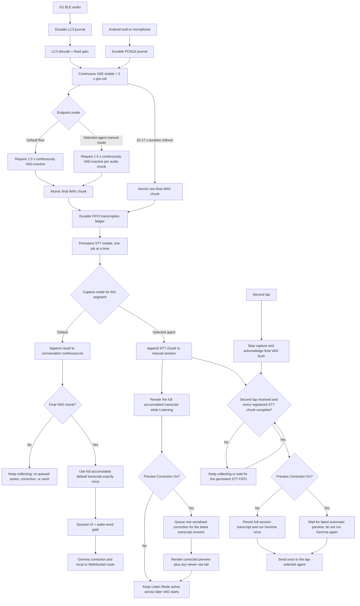

# Local audio pipeline and recovery



The capture journal, decoder, VAD, transcription, BLE callbacks, and Flutter
rendering do not share a work queue. A slow model or UI frame cannot block raw
audio persistence. The transcription isolate stays loaded and the supervisor
dispatches its durable FIFO one WAV at a time. A completed job immediately
allows the next queued job to start, even while its transcript is being
appended and evaluated by the coordinator.

The local `Hey Memo` consumer claims only live finalized transcript segments
after their raw text is durable. It never owns LC3, PCM, VAD, or STT work and
never routes memo dictation to the Voice WebSocket. See
[Hey Memo voice notes](VOICE_MEMO.md).

## Startup contract

The app renders immediately, then initializes storage, LC3, acceleration
capabilities, VAD, and transcription in order. The Connect button remains
disabled until all local audio components report ready. Model files are copied to
app-private storage with SHA-256 verification; a verified marker avoids
rehashing large files on each launch.

The Android device is probed for GPU/OpenGL and NNAPI API availability before
either model worker is created. These values are hardware and platform hints,
not provider proof. Silero VAD and the selected transcription model qualify
their providers independently and report separate provider markers.

The checked-in arm64 Flutter FFI package replaces the public
`sherpa_onnx_android_arm64` artifact. It pins Sherpa-ONNX `v1.13.4` and ONNX
Runtime `1.27.0`, compiles Sherpa for Android API 27 so the NNAPI registration
branch exists, and passes `NNAPI_FLAG_CPU_DISABLED`. That flag excludes NNAPI's
reference-CPU device; ONNX Runtime's normal CPU provider still handles
unsupported nodes and remains the whole-model fallback.

Android API 29 is the minimum for offering the NNAPI candidate because older
Android versions ignore the CPU-disabled flag. The worker creates a temporary
provider configuration in the app cache, enables ONNX Runtime profiling,
decodes silent input, destroys the candidate so the profile is finalized, and
counts provider-assigned node executions. It accepts `nnapi` only when at least
one node names `NnapiExecutionProvider`. Raw profiles are deleted immediately
and never enter the user-selected audio folder. A missing, malformed, or
CPU-only profile retries with `cpu`.

The packaged runtime has no Android GPU or Qualcomm QNN execution provider.
NNAPI may route compatible partitions to a vendor NPU, DSP, or GPU, but its API
does not let Work Bench promise which accelerator a vendor driver selects.
Direct Qualcomm NPU execution is a separate deployment target requiring a
QNN-enabled native runtime, redistributable QNN libraries, and qualified
device/model artifacts.

Static graph inspection explains why a valid runtime can still select CPU:

| Workload | Relevant graph boundary |
| --- | --- |
| Silero VAD | The wrapper contains nested `If` and `LSTM` nodes, neither of which establishes an NNAPI partition by itself |
| Parakeet 110M INT8 | Uses `DynamicQuantizeLinear`, `ConvInteger`, `MatMulInteger`, and `LayerNormalization` forms outside the documented NNAPI operator path |
| Parakeet 0.6B INT8 | Uses the same dynamic integer forms, plus a Microsoft-domain dynamically quantized LSTM decoder |
| Tiny Whisper | Contains supported matrix/convolution work but also `Erf`, dynamic shape, range, scatter, expand, and selection operations that can fragment partitions |

The table is a compatibility warning, not provider evidence. Qualification is
recorded independently for Silero VAD, Parakeet 0.6B, Parakeet 110M, and Tiny
Whisper on each runtime, OS, and device family.

Rebuild the pinned package with:

```sh
ANDROID_SDK=<android-sdk-directory> \
ANDROID_NDK=<android-ndk-directory> \
  ./tool/build_sherpa_nnapi_runtime.sh
```

The package README, patch, licenses, and SHA-256 runtime manifest are under
`third_party/sherpa_onnx_android_arm64_nnapi/`.

## Audio safety

- G2 supplies five 40-byte, 10 ms LC3 frames in each normal 200-byte
  notification. Work Bench pins capture to the first active lens so duplicate
  left/right notifications are not decoded twice.
- A packet reaches decoding only after its sequence, timestamp, length,
  checksum, and bytes have been flushed to the append-only journal.
- Decoded PCM receives a fixed 16× clipping-safe gain before metering, VAD,
  speech-WAV persistence, and transcription. G2 microphone output otherwise
  remains well below the operating range of the local speech models. The raw
  LC3 journal is unchanged and remains available for recovery.
- The journal flushes at most every 250 ms or five packets and rotates about
  every 15 minutes.
- Pending packets stay in memory while the journal isolate restarts. If the
  bounded queue reaches 600 packets, Work Bench disconnects the wearables
  instead of silently dropping unjournaled source audio.
- VAD saves speech only. It keeps two seconds before speech. The default flow
  requires 1,500 ms continuously VAD-inactive after Silero's 500 ms silence
  qualification, for a nominal two-second acoustic-silence boundary.
  Selected-agent Listen Mode is a separate, manually bounded mode with a
  one-second VAD-inactive audio-chunk endpoint. Speech resuming during either
  endpoint cancels that pending chunk boundary. In default mode it remains in
  the same logical turn; in selected-agent mode a completed endpoint queues STT
  but leaves the manual session active for later speech. The
  `speech_ended` marker reports the retained tail as `audio_ms`, independent of
  UI scheduling. It writes a partial WAV first and atomically renames completed
  files. When the endpoint begins, Work Bench clears earlier turn history from
  pre-roll and then retains the endpoint-tail PCM. That handoff prevents prior
  speech from leaking into the next turn without dropping the opening of a
  near-boundary next utterance.
- In selected-agent mode, the first tap snapshots the configured agent and
  starts one transcript accumulator. Every completed STT chunk is appended in
  FIFO order and the body renders only the accumulated text on G2; the single
  status beside the agent name blinks while STT is pending. VAD silence never
  sends or
  exits Listen Mode. Preview Correction defaults Off. When it is On, every STT
  append schedules one serialized correction of the newest complete revision;
  an append during inference is shown as a raw tail and coalesced into the next
  preview. The second tap is the only send boundary: it stops capture and waits
  for the VAD flush acknowledgement and every registered STT result. Preview
  Off then queues one prioritized correction of the aggregate. Preview On waits
  for and reuses the latest automatic correction, with no second Gemma call at
  Send. A failed Preview On correction keeps the raw transcript and does not
  retry merely because Send was tapped.
- In the default flow, continuous speech remains one logical VAD conversation
  until endpoint silence. At 15 seconds, the current chunk begins looking for the next short
  low-energy inter-word gap as well as a VAD-low pause. Once audio or VAD
  resumes, Work Bench closes the old WAV before writing that first resumed
  speech frame and starts the next WAV without overlap. If no credible word
  boundary appears, a 17-second hard limit closes the
  chunk and prepends the final one second of audio to its continuation. This
  overlap is padding for STT word-boundary safety; exact repeated leading words
  are removed from the continuous transcript. A duration
  rollover never emits a false silence endpoint, clears the visible
  conversation, or arms Memo's silence timer. Each original raw chunk remains
  independently durable, and recognized text is appended by atomic replacement
  to one `<conversation>.continuous.txt` file. Intermediate STT results never
  enter correction or delivery. The final chunk opens that boundary once and
  supplies the full accumulated transcript to the bounded glasses FIFO as one
  `Queued` item, followed by `Saved` or `Sent`.
- In the default mode, Gemma correction is eligible only when a recognized
  chunk begins with the complete word `hey`, case-insensitively. Ordinary ambient chunks and
  mid-sentence mentions bypass the LLM, receive a durable `no_wake_word` skip
  record so they cannot be restored into the correction queue after restart,
  and remain available as raw text. An explicitly started selected-agent
  session makes its final manually submitted aggregate Gemma-eligible without
  a spoken wake/name. With Preview Off, its intermediate STT chunks remain
  collection-only and correction runs at Send. With Preview On, intermediate
  chunks update a local correction preview, but only the final cached aggregate
  may route. All other speech retains the normal attention gate.
- A wearable disconnect flushes an active VAD segment before changing link
  state. Raw journals, WAV files, and completed transcripts are never deleted
  by a model restart.

Files use the application-support directory:

```text
workbench/audio/
├── journal/lc3-<UTC timestamp>.wblc3
└── speech/
    ├── <segment>.wav
    ├── <segment>.raw.txt
    ├── <conversation>.continuous.txt
    ├── pending-transcriptions.json
    └── transcripts.jsonl
```

App-private storage remains the reliable source of truth. On Android, the
**Tools → Transcription → File storage** setting opens the system folder picker
and retains only the narrow read/write document-tree grant selected by the
user. The app does not request broad storage permission. Completed speech WAV
and text files plus `workbench-correction-prompt.txt` are stored in that folder
so they are visible in Files and to other apps after the user gives those apps
access to the same location. Choosing a folder also copies existing completed
speech files. If the folder already contains a valid correction prompt, that
value is loaded for the next correction and mirrored into app-private storage.
Otherwise the app creates the prompt file from its last-known-good private
value.

Acknowledged outbound WebSocket commands and readable inbound progress or
completion summaries are saved atomically in app-private storage, then exported
with `.sent.message.txt` or `.received.message.txt` direction suffixes.
Existing message records are synchronized when the app starts or the shared
folder changes. The reserved `.message.txt` suffix is excluded from transcript
enumeration.

Home's **Messages** tab retains those sent/received records with completed
transcripts from the same Android document provider. Its default **All** chip
shows that complete view without a composer. Configured-agent chips filter the
app-private correlated sent/received ledger and reveal one direct message
field, even when no shared folder is selected. It pairs each transcript
with a same-name `.wav` and reads or plays files directly from the shared
folder. Playback uses the content URI rather than copying audio back into
private storage. The native bridge maintains app-private SQLite indexes of
agent messages, ordinary transcripts, and conversation turns. A normal
**Messages** selection queries SQLite instead of reopening every shared text
document. Every successful app export updates the index incrementally and then
writes one of two rotating `workbench-history-cache-*.sqlite3` recovery
snapshots to the selected folder. A snapshot contains only history rows; live
SQLite sidecars, cache metadata, and export fingerprints remain private. After
reinstall, the user reselects the same folder and the newest size-bounded,
integrity-checked snapshot seeds the private index. The first selection after
upgrading or changing folders performs a one-time shared-folder import; the
explicit refresh action performs a full reconciliation for files changed by
another app. The shared WAV/TXT files remain the interoperable source of truth,
and playback still uses their content URIs.

The same folder holds two narrowly scoped recovery documents outside SQLite:
`workbench-agent-servers.json` contains server fields but no secret, while
`workbench-speaker-signatures.wbprofiles` contains sensitive validated speaker
profile data. Server recovery always requires the secret again. Speaker
signatures never enter readable conversation text or the SQLite history index.

The same private database records successful export fingerprints. Background
recovery sync skips unchanged files that are still present in the native
document index, so opening Messages is not queued behind redundant copies of
the complete capture archive.

The list presents the newest combined records first in bounded batches.
The separate **Conversation** tab displays only optional speaker-attributed
turns. **Events** is the default peer tab and retains only the 30 most recent
in-app events. The native storage bridge also
keeps an app-private filename-to-document-URI index. This preserves
deterministic listing and playback on OEM document providers that accept
writes but return an empty child-directory query. The correction prompt is
deliberately excluded from transcript enumeration.

Shared export is downstream from durable capture: a revoked grant, unavailable
document provider, or copy failure never blocks journaling, VAD, or local
transcription. The UI reports the export failure and asks the user to choose
the folder again. Raw LC3 journals, partial files, the transcription ledger,
the JSONL index, and model files stay app-private.

## Failure isolation and recovery

| Failure | Recovery | BLE/audio impact |
| --- | --- | --- |
| Journal isolate exits | Replays all unacknowledged packets after restart | No loss while the bounded queue has capacity |
| VAD isolate exits | Restarts and replays up to 30 seconds of PCM | Journal and BLE continue |
| Transcription isolate exits | Restarts the model and resubmits ledger jobs | Journal, VAD, and BLE continue |
| G2 audio notifications stall | Reissues the Hub audio-start command | Does not restart BLE or models |
| Expected Disconnect | Flushes speech and keeps models loaded | User can immediately reconnect |
| Unexpected G2 link loss | Flushes speech, retries both lenses, restores Hub audio | Process and local model workers stay alive |
| Android adapter turns off | Ignores only late native BLE cancellation errors, waits, reconnects after adapter recovery | Process remains alive |
| Capture queue overflows | Logs a fatal safety marker and disconnects | Prevents silent source loss |
| Shared folder is unavailable | Keeps app-private files and prompts for a new folder grant | Journal, VAD, transcription, and BLE continue |

Tools exposes diagnostic VAD and transcription restarts. These controls kill
only the selected worker, making the recovery paths testable without cycling
Bluetooth.

## Model setup

Large model artifacts are intentionally not committed. Install the exact
hash-verified Sherpa-ONNX models before building:

```sh
./tool/fetch_speech_models.sh
```

The script downloads the official Silero VAD and `tiny.en` Whisper release,
verifies every runtime file, and installs it under `assets/models/`. Tiny
Whisper remains the portable bundled fallback.

Parakeet 0.6B is the default selection. Parakeet 110M and Tiny Whisper can be
selected from **Tools → Transcription**, and the selection persists across app
restarts. The Parakeet files stay out of the APK and must be staged into
app-private storage:

```sh
./tool/stage_android_stt_model.sh parakeet-110m
./tool/stage_android_stt_model.sh parakeet-0.6b
flutter run
```

Changing the setting verifies the requested files before stopping the current
worker, then reloads only transcription. Raw capture, BLE, ring input, and VAD
continue, and any interrupted WAV remains in the durable ledger for the new
worker. A load failure restores the prior model and does not change the saved
preference.

Parakeet 110M is the lower-memory option; the 0.6B model requires substantially
more memory. The 0.6B model remains the default by product choice. All STT
variants remain behind the same
transcription-worker boundary and cannot own the journal, BLE callbacks, or VAD
recovery buffer.

## Optional conversation worker

Speaker diarization is disabled by default and branches only after VAD has
atomically finalized the ordinary speech WAV. The primary STT starts first;
then a non-awaited callback gives the optional service the same WAV path. No
second live LC3/PCM buffer is retained.

The optional service owns pyannote segmentation, TitaNet Small embeddings, and
a separate CPU Parakeet 110M recognizer in a supervised Dart isolate. It has a
separate durable queue and output files. Model, worker, transcription, speaker
matching, export, and database failures leave capture, VAD, primary STT, Gemma,
BLE, and the voice WebSocket unchanged.

Primary STT is dispatched before the conversation handoff, which is scheduled
on an independent event path and runs in its own isolate. The app intentionally
allows the primary recognizer and conversation Parakeet 110M recognizer to be
loaded and executing at the same time. Gemma correction never waits for
diarization analysis or native worker teardown; Android memory pressure may
release only the optional worker without joining that cleanup to the primary
pipeline.

See [Independent conversation analysis](CONVERSATION_ANALYSIS.md) for the
enrollment, matching, storage, and validation contracts.

See [Transcription turn test plan](TRANSCRIPTION_TURN_TEST_PLAN.md) for the
computer-speaker Kokoro cases and turn-level acceptance criteria.

## Phone microphone input

On Android, **Start microphone** beside **Connect devices** records the phone's
built-in microphone while G2 is fully disconnected. The control requests
microphone permission on first use. **Stop microphone** releases the recorder,
drains captured audio, and finalizes the current speech segment. Connect is
disabled until that handoff finishes; the microphone is disabled throughout G2
connection and reconnection. Recording never starts automatically after a
Bluetooth disconnect or an app/process restart.

`AndroidMicrophoneCapture` requests 16 kHz mono PCM16 from Android AudioRecord;
Android supplies the requested capture format. The app verifies the sample
rate, channel count, encoding, and actual built-in input route. Unsupported
formats, changed routes, silenced recording, and capture failures stop the
source. Short samples are explicitly serialized little endian. After durable
PCM journaling, phone input receives an 8x digital gain (about +18 dB) before
metering, VAD, and speech WAV persistence. It reuses the G2 PCM gain routine's
signed 16-bit saturation to prevent overflow; loud input can still clip. The
original journal preserves unamplified samples. G2 retains its 16x gain, and
phone input does not encode/decode LC3.

Native capture has one producer and a bounded six-second queue. Dart pulls one
chunk at a time into the existing capture-journal worker. PCM journaling has a
six-second byte bound and acknowledges only disk-flushed records. A `.wbpcm`
file starts with `WBPCM` and version byte 1, followed by little-endian sample
rate (uint32), channels (uint16), and bits per sample (uint16). Each record uses
the existing length, sequence, timestamp, checksum, and payload layout. Existing
`.wblc3` files remain compatible. Journals remain app-private; the shared VAD
writer produces the same 16 kHz, mono, PCM16 WAV files for either source.

Metering, VAD recovery, speech segmentation, atomic raw/corrected transcripts,
STT, correction, history/export, and agent invocation all use the existing
pipeline. Conversation analysis remains an independent consumer of durable
speech WAVs. Stopping capture does not cancel queued local processing, and
restored jobs cannot send agent commands.

The phone preview tracks the latest live turn through Original, Corrected,
Sending, and Sent (only after the server acknowledgement), or Saved when it
does not send. Late correction or delivery results cannot overwrite a newer
utterance. Messages reads recent atomic app-private sent/received records
immediately and merges them with exported history by filename. Missing shared
storage or export failure must not hide these local messages; the raw and
corrected transcript files remain separate.

`MicrophoneCaptureService` owns a separate microphone foreground notification
and wake lock. It requires RECORD_AUDIO and the microphone foreground-service
type, starts only from the visible app, and does not require Bluetooth
permissions. It supports recording while the app is backgrounded or the screen
is off, but never restarts itself after process death. Activity teardown stops
the recorder. The existing Bluetooth foreground service retains its own owner.

For a physical phone test, run the host-only Kokoro fixture with an explicit
Android target and a fresh evidence directory outside the repository:

```sh
python3 tool/validate_phone_microphone.py \
  --serial '<android-serial>' \
  --output-dir /tmp/workbench-phone-microphone-trial-001
```

Add `--background` to repeat with Work Bench in the background during playback.
The runner shares synthesis, `af_maple`, 90% host volume, one second of leading
silence, 500 ms of trailing silence, volume restoration, and playback markers
with the G2 skill. Its preflight uses the visible microphone control separately
from the unchanged G2 connection preflight. It preserves the stimulus, played
WAV, captured speech WAVs, SHA-256 manifests, logs, and report for each trial.
Run the checked-in G2 skill afterward to validate both sources independently.

Run `flutter analyze`, `flutter test`, and
`python3 tool/test_validate_phone_microphone.py` for static and regression
checks. The phone preflight rejects a disabled toggle and requires fresh PCM
before speaker playback. Its UI probe retries a missing hierarchy a bounded
number of times. Keep the G2 skill's two runner test files passing as well.
